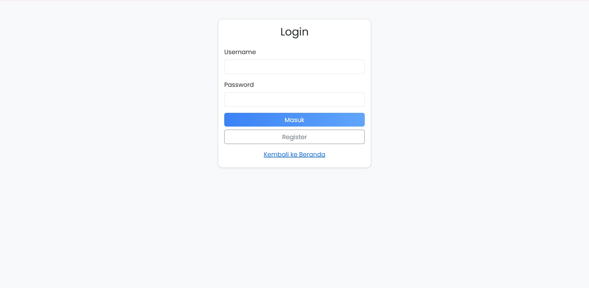
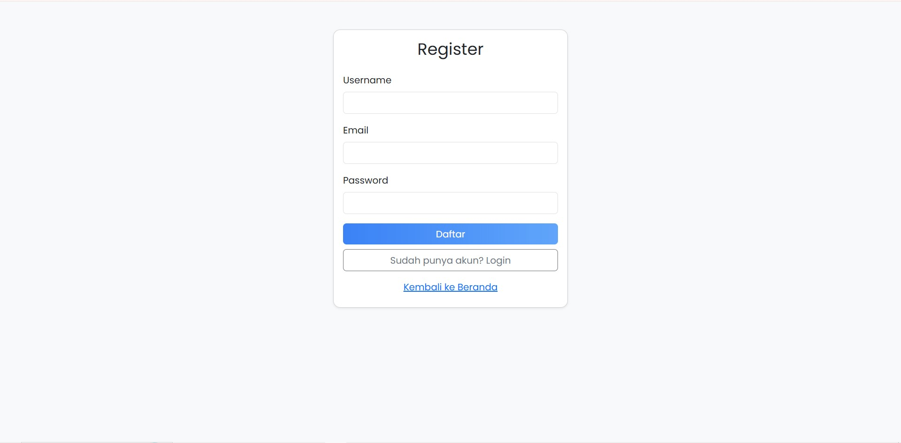
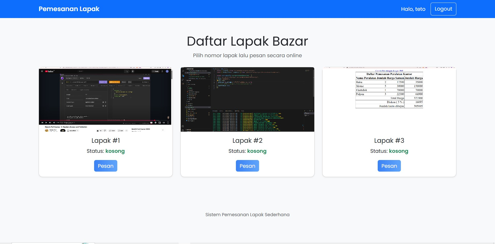
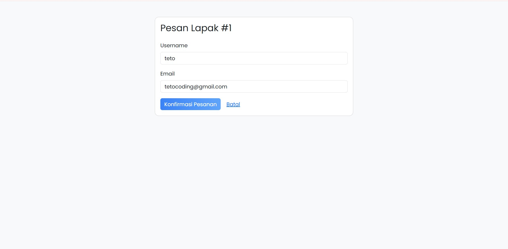
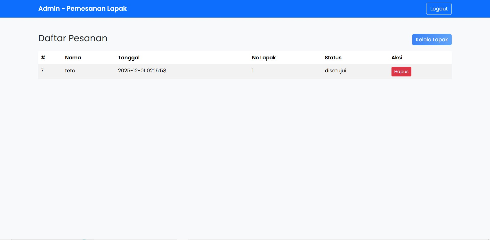
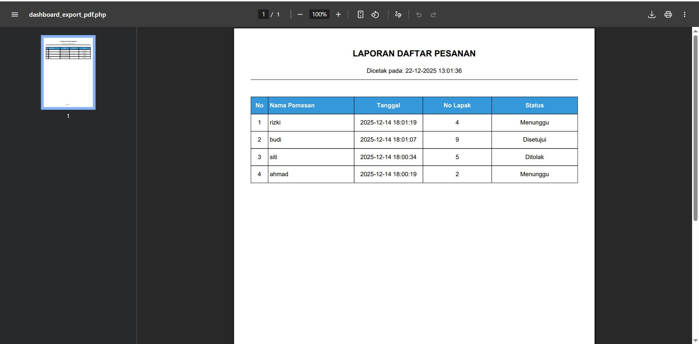
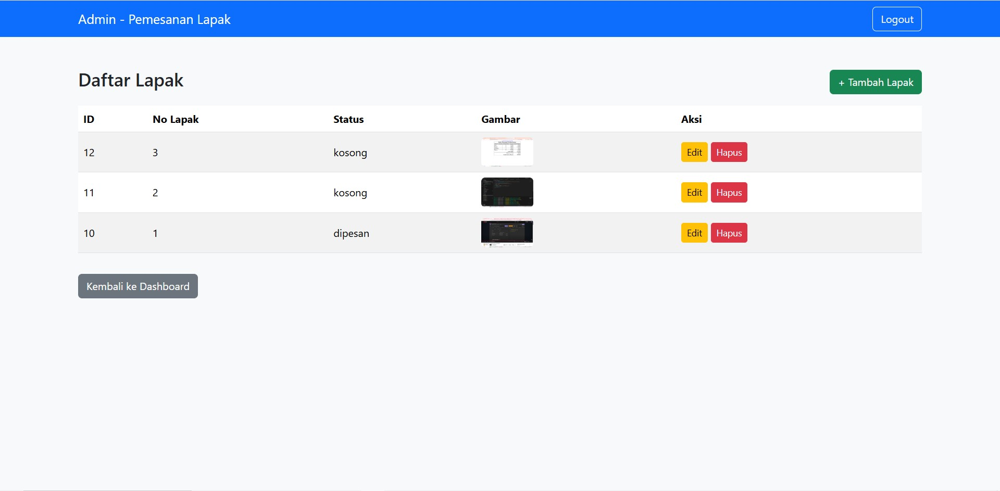
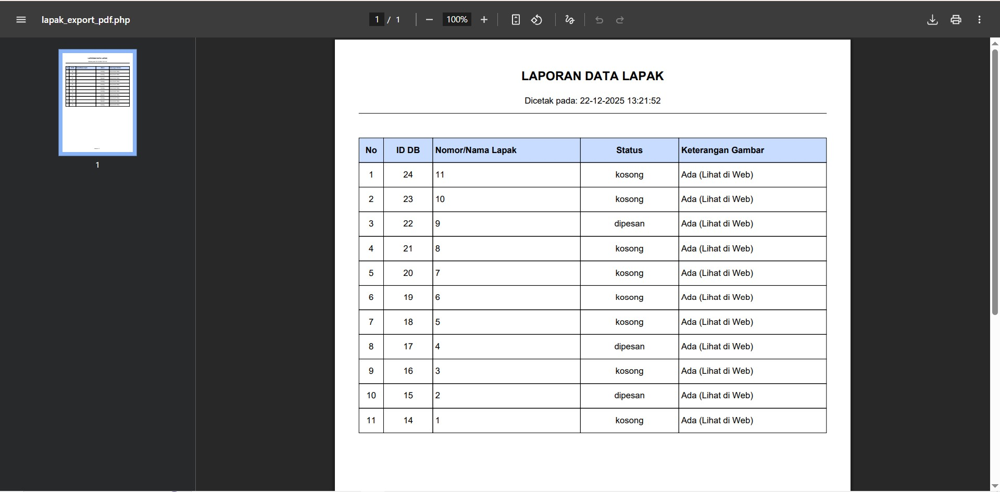
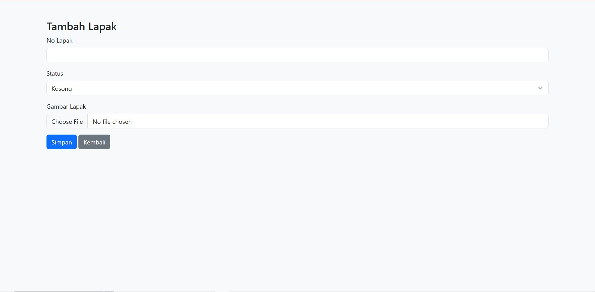
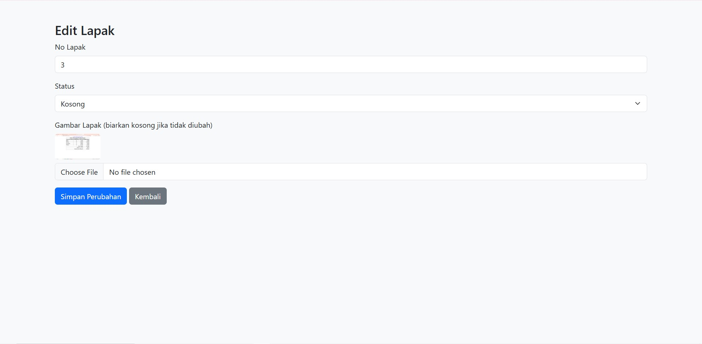

Sistem Pemesanan Lapak Sederhana

ini adalah web untuk sistem pemesanan lapak

ada 3 role untuk web ini yaitu role Guest, User, dan Admin

Tiap tiap role memiliki halamannya sendiri

Role Guest

1. halaman landing page

Disini ada navbar yang ada logo dan tombol login dan register
Lalu di bawahnya ada kumpulan card yang isinya adalah lapak yang bisa di pesan karena belum login maka tampilan button nya login untuk pesan

2. halaman login

Disini adalah halaman login untuk user dan admin, mengisi form username dan password

3. halaman register

Disini halaman register untuk akun baru, formnya mengisi username, email dan password

Role User
1. halaman landing page

Disini sama seperti halaman guest bedanya di navbar bukann button login dan register tapi text halo dan button logout
di card tombol pesan jadi tampil karena sudah login dan dklik maka redirect ke halaman pesan

2. halaman pesan

Disini adalah halaman untuk user memesan lapak, tinggal isi username dan email saja

Role Admin
1. halaman Dashboard

Ini adalah halaman dashboard untuk admin, isinya ada button export pdf untuk mengarsipkan riwayat pesanan user dan button kelola lapak untuk pindah ke halaman kelola lapak
Dibawahnya ada Daftar pesanan user yang statusnya menunggu, ditolak dan disetujui, dan disampling per listya ada button untuk mengubah status dari pesanan tersebut

2. isi pdf pesanan

Ini adalah pdf yang dihasilkan dari button export pdf tadi

3. kelola lapak

disini berisi tombol export pdf untuk arsip lapak ke pdf dan tombol tambah lapak untuk pindah ke halaman tambah lapak
ada tampilan untuk daftar lapak untuk di sewakan nantinya. per listnya memiliki tombol edit untuk pindah ke halaman edit dan hapus untuk menghilangkannya

4. isi pdf lapak

ini isi dari pdf lapak

5. tambah lapak

ini adalah halaman tambah lapak, kita mengisi nomor lapak, statusnya kosong atau dipesan lalu mengupload gambar

6. edit lapak

halaman untuk mengedit lapak yang sudah dibuat, bisa mengedit nomor, status dan gambarnya

akun uji coba:
admin
username : admin
password : 123

user
username : ahmad
password : 123
